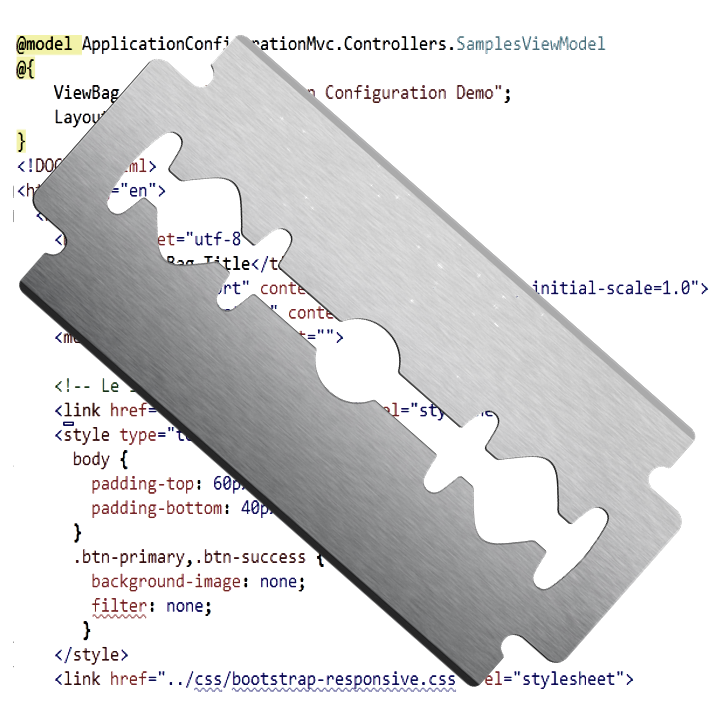

# Westwind.RazorHosting
#### Hosting the Razor Runtime outside of ASP.NET MVC/WebPages




This library allows you to host the Razor template engine found in ASP.NET MVC and ASP.NET WebPages in your own applications and ASP.NET applications outside of MVC and Web Pages.

Razor is a great tool for text templating using HTML like syntax mixed with C# code. The engine can be used for things like text merging for things like Mail Merge operations, HTML reports or HTML displays in desktop applications, code generation and much more. You can use it in Desktop applications as well as in any ASP.NET application that doesn't already have ready access to the Razor View engine.

* [Install from NuGet (Westwind.RazorHosting)](http://nuget.org/packages/Westwind.RazorHosting)
* [Westwind.RazorHosting Documentation](http://west-wind.com/files/tools/razorhosting/docs/)
* [Change Log](https://github.com/RickStrahl/Westwind.RazorHosting/blob/master/ChangeLog.md)
* [Questions and Discussion of Westwind.RazorHosting](http://www.west-wind.com/wwThreads/default.asp?Forum=West+Wind+.NET+Tools+and+Demos)

> #### Note
> The RazorHosting engine provides core templating functionality of the Razor sytnax engine. This means that all C# language features and all of Razor's basic expression and logic parsing features work.
>
> It **does not** provide full parity with either the MVC or WebPages implementation, since both of these engines are closely tied to ASP.NET semantics. Things like HTML and URL Helpers, Sections, Partials and Layout pages are not natively supported by Razor. **Partials, Helpers and Layout pages are supported only in the Folder Host implementation**.
>
> RazorHosting only supports C# - there's no support for Visual Basic.

### Installation
The easiest way to install is via NuGet:

```
install-package westwind.razorhosting
```

The package requires .NET 4.5 or later.

###  Basics
This Razor Host library provides two distinct hosting models:

* **Raw Razor Engine**
A very easy to use template function. Useful for very simple one off Template rendering from strings. 

* **Razor Host Containers**   
A wrapper around the base Razor Engine that provide cached templates, support for serving templates from a folder hierarchy (like ASP.NET) and optionally loading templates in a separate AppDomain. Folder containers provide additional functionality like support for partials and other non-native Razor features.

For real world applications you almost always use a Host Container.

### Plain RazorEngine Usage
RazorEngine is the base template parsing engine. It's very easy to use but provides no internal caching or fixup of templates.

To execute a template:

```c#
string template = @"Hello World @Model.Name. Time is: @DateTime.Now";
var host = new RazorEngine();
string result = host.RenderTemplate(template,new { Name="Joe Doe" });
```

You can also create a template, compile it and then cache it yourself:

```c#
string template = @"Hello World @Model.Name. Time is: @DateTime.Now";
var host = new RazorEngine<RazorTemplateBase>();
host.AddAssembly("System.Data.dll");  // add any assemblies you need in templates            
    
string compiledId = host.CompileTemplate(template);    
string result = host.RenderTemplateFromAssembly(compiledId,
												new Person() { Name = "Joe Doe" });

// Run again later without recompilation
string result = host.RenderTemplateFromAssembly(compiledId,
												new Person() { Name = "Rick Strahl" });
```

The latter allows you to capture the compiled id which points to a cached template assembly in the current RazorEngine instance. This avoids  reparsing and recompiling the template each time it's executed.

> #### Caching is Important
> Razor compiles every template into code and compiles the template into an assembly. Without caching, templates are constantly recreated and new assemblies are created which wastes resources. Since assemblies can't unload this basically means you have a memory leak. Cache your templates either as described above, or use one of the host containers which automatically cache templates/assemblies and detect when they change.


All templates include a `Model` property and the `RenderTemplate()` method can pass in a model. By default models are of type `dynamic`, but the model can also be explicitly typed by using the Razor @inherits tag:

```
@inherits RazorTemplateBase<RazorHostingTests.Person>
```

you can also use the @model tag:

```
@model RazorHostingTests.Person
```

but if you will not get Intellisense in Visual Studio if you open the template there. For that reason we recommend the first syntax.

If no `@model` or `@inherits` is specified, the Model is assumed to be of type `dynamic`.

### Using Host Containers
Host Containers wrap the basic `RazorEngine` by providing automatic caching for templates, automatic template change detection and the ability to optionally run the Razor templates in a separate AppDomain.

There are two provided HostContainers:

* RazorStringHostContainer
* RazorFolderHostContainer

HostContainers are meant to be **reused**, so you typically instantiate it once, then hang on to the reference and reuse it for subsequent requests. The template cache is associated with an instance so in order to get the caching benefit the instance needs to stay alive.


### RazorStringHostContainer
StringHostContainer executes templates from string, but caches the compiled templates based on the template's content. IOW, running the same exact template twice will automatically compile on the first run, and use the cached version on the second and subsequent runs. As long as the the template string is identical the cached assembly is used.

To run a String Template Host:

```c#
var host = new RazorStringHostContainer();
//host.UseAppDomain = true; 
        
// add model assembly - ie. this assembly
host.AddAssemblyFromType(this);
host.AddAssembly("System.Data.dll");
    
// must start the host container
host.Start();
              
// Create a model to pass in
Person person = new Person()
{
    Name = "Rick",
    Company = "West Wind",
    Entered = DateTime.Now,
    Address = new Address()
    {
        Street = "32 Kaiea",
        City = "Paia"
    }
};

// create a template to render
string template = @"@inherits Westwind.RazorTemplateBase<RazorHostingTests.Person>
<b>@Model.Name of @Model.Company entered on @Model.Entered";
    
// Render the actual template and pass the model
string result = host.RenderTemplate(string,person);
    	
Console.WriteLine(result);
Console.WriteLine("---");
Console.WriteLine(host.Engine.LastGeneratedCode);

if (result == null)
    Assert.Fail(host.ErrorMessage);

// shut down the host            
host.Stop();

// Hosts also implement IDisposable to Stop
host.Dispose();  
```

With a host container you typically will run many requests between the Start() and Stop() operations.

### RazorFolderHostContainer
The RazorFolderHostContainer can be used to point to a folder on disk and treat it like a virtual directory for rendering templates from disk. Templates are loaded based on a virtual path (`~/page.cshtml` and `~/sub/page.cshtml`) relative to the base folder, and support usage for subpages via `@RenderPartial()` and layout pages via the `Layout` property.

To run folder host templates:

```c#
var host = new RazorFolderHostContainer();

// must specify the base path ('Virtual' root path) for templates
host.TemplatePath = Path.GetFullPath(@"..\..\FileTemplates\");

// point at the folder where dependent assemblies can be found
// this applies only to separate AppDomain hosting
host.BaseBinaryFolder = Environment.CurrentDirectory;

// add model assembly - ie. this assembly
host.AddAssemblyFromType(typeof(Person));

host.UseAppDomain = true;
//host.Configuration.CompileToMemory = true;
//host.Configuration.TempAssemblyPath = Environment.CurrentDirectory;

// Always must start the host
host.Start();

// create a model to pass
Person person = new Person()
{
	Name = "Rick",
	Company = "West Wind",
	Entered = DateTime.Now,
	Address = new Address()
	{
		Street = "32 Kaiea",
		City = "Paia"
	}
};

// render a template and pass the model
string result = host.RenderTemplate("~/HelloWorld.cshtml", person);

Console.WriteLine(result);
Console.WriteLine("---");
Console.WriteLine(host.Engine.LastGeneratedCode);

host.Stop();

if (result == null)
	Assert.Fail(host.ErrorMessage);

Assert.IsTrue(result.Contains("West Wind"));
```
	   
where the template might look like this:

```html
@inherits RazorTemplateFolderHost<RazorHostingTests.Person>
<!DOCTYPE html>
<html>
<head>
	<meta charset="utf-8" />
	<title></title>
</head>
<body>    
    @RenderPartial("~/Header_Partial.cshtml",Model)

	@Model.Name @Model.Company @Model.Address.City @Model.Entered 
    
	@{for (int i = 0; i < 10; i++)
		{
			Response.WriteLine(i + ".");
		}  

	You can also render nested templates from string
	@RenderTemplate("Child Template rendered from String. Name: @Model.Name",Model) 
</body>
</html>
```

> #### @RenderPartial()
> Note that you can render partials, by specifying the virtual path for the partial
> relative to the to TemplateBasePath specified.
> ```
> @RenderPartial("~/Partials/PartialComponent.cshtml",model)
> ```

### Html Helpers
You can also use HTML Helpers in your Razor views:

```html
@helper WriteBlockText(string text)
{
    <b>*** @text ***</b>
}

Helper output: @WriteBlockText("Help me!");
```

### Rendering Layout Pages
You can also use Layout pages with the RazorFolderHostContainer by specifying the `Layout` property in your view/template.

```html
@inherits Westwind.RazorHosting.RazorTemplateFolderHost<RazorHostingTests.Person>
@{
    Layout = "~/_Layout.cshtml"
}
<h3>Hello @Model.Firstname</h3>
<p>
this is my page content rendered at @DateTime.Now.
</p>
```

The View Page then:

```html
@inherits Westwind.RazorHosting.RazorTemplateFolderHost<RazorHostingTests.Person>

<h1>Layout Page Header</h1>
<hr />

@RenderBody()

<hr/>
&copy; West Wind Technologies, 2010-@DateTime.Now.Year
```

Note that you should use the same model your are passing to the content page as a parameter in the layout page - if you plan on accessing model content.

### Running in a separate AppDomain wiht UseAppDomain
Note that you can choose to host the container in a separate AppDomain by using:

```c#
host.UseAppDomain = true;
```

If you do, make sure any models  passed to the host for rendering are marked serializable or inherit from MarshalByRefObject. Using an AppDomain is useful when loading lots of templates and allows for unloading the engine to reduce memory usage. It also helps isolate template code from the rest of your application for security purposes, since Razor templates essentially can execute any code in the context of the host.

### Limitations
Unlike MVC and/or WebPages the RazorHosting engine only supports core Razor functinonality
so it's not equivalent to the feature set provided by MVC or WebPages. As such many common
features like HTML and URL helpers, @Section and @Layout directives are not available 
in this implementation since these features are specific to MVC/WebPages and their close ties to 
the HTTP features provided in ASP.NET. There is support for @helper though.

Only the RazorFolderHostContainer supports partial rendering.

## License
This library is published under MIT license terms:

Copyright &copy; 2012-2013 Rick Strahl, West Wind Technologies

Permission is hereby granted, free of charge, to any person obtaining a copy of this software and
associated documentation files (the "Software"), to deal in the Software without restriction, 
including without limitation the rights to use, copy, modify, merge, publish, distribute, sublicense, 
and/or sell copies of the Software, and to permit persons to whom the Software is furnished to do so,
subject to the following conditions:

The above copyright notice and this permission notice shall be included in all copies or substantial 
portions of the Software.

THE SOFTWARE IS PROVIDED "AS IS", WITHOUT WARRANTY OF ANY KIND, EXPRESS OR IMPLIED, 
INCLUDING BUT NOT LIMITED TO THE WARRANTIES OF MERCHANTABILITY, FITNESS FOR A PARTICULAR PURPOSE AND 
NONINFRINGEMENT. IN NO EVENT SHALL THE AUTHORS OR COPYRIGHT HOLDERS BE LIABLE FOR ANY CLAIM,
DAMAGES OR OTHER LIABILITY, WHETHER IN AN ACTION OF CONTRACT, TORT OR OTHERWISE, ARISING FROM, 
OUT OF OR IN CONNECTION WITH THE SOFTWARE OR THE USE OR OTHER DEALINGS IN THE SOFTWARE.
